# Pasos para tomar examen con Respondus LockDown Browser

## ¿Qué es Respondus LockDown Browser?

Respondus LockDown Browser es un navegador (browser) para tomar exámenes en Moodle. El navegador aumenta la seguridad de los exámenes en línea evitando que los estudiantes accedan a otras páginas de Internet y, a otras aplicaciones. Asimismo, desactiva las funciones de copiar, pegar e imprimir. Solo permite acceder a la página web en la cual se tomará el examen. Los estudiantes no podrán cerrar el examen hasta que lo hayan sometido para calificación.

## Requisitos técnicos del navegador

Para instalar Respondus LockDown Browser en su computadora personal se requiere:
1. Utilizar el Navegador Mozilla Firefox

2. Poseer permiso de administrador para instalar el navegador en su computadora
	>El permiso consiste en que pueda instalar y desinstalar programas a su conveniencia.

3. El equipo que utilice debe tener cámara web, micrófono y una conexión al Internet de Banda ancha (broadband).

## ¿Qué es Respondus Monitor?

Respondus Monitor es un software que funge como custodio (Proctor). Los estudiantes son grabados mientras están completando el examen en línea. Este custodio en línea genera imágenes y videos que son utilizados para validar la identidad del estudiante.

#### Requisitos del sistema
- Windows: 10, 8, 7
- Mac: OS X 10.10 o más avanzado
- Adobe Flash Player
- Cámara web (interna o externa) y micrófono
- Conexión al internet de banda ancha

## Pasos para tomar un examen que requiere LockDown Browser y Respondus Monitor
1. Cierre todos los programas.

2. Localice el icono de `LockDown Browser` en el escritorio de su computadora (desktop) y oprima sobre este. Si está utilizando una Mac, abra el navegador desde el archivo de las aplicaciones.

	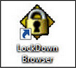

3. Automáticamente se abrirá una ventana.

4. Seleccione el servidor `ievonline.pucpr.edu` y oprima `Ok`. La página de Moodle se abrirá.

	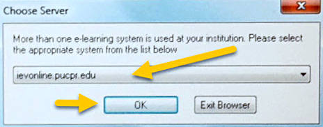

	>Se recomienda que actualice el navegador LockDown Browser antes de acceder al curso en línea para tomar el examen. Para actualizarlo, oprima el círculo con la letra i ubicado en el menú superior a la izquierda.

5. Luego de activar el navegador (LockDown Browser), ingrese sus credenciales para acceder al curso.

6. En la página del curso busque el examen(quizzes) y oprima sobre el botón Intente resolver la prueba ahora `Attempt quiz now`.
	> Si el examen requiere contraseña, el sistema le pedirá que la ingrese. Siga las instrucciones que indique el profesor para tomar el examen. Una vez ingresada la contraseña, el sistema abre la cámara web y comienza la validación.
	> Debe tener a la mano su tarjeta de identificación.

## Proceso de validación

1. ***Terms of Use*** – Revise y acuerde los términos de uso, presionando el botón `Agree`. El sistema le pedirá que ejecute varias acciones, según lo haya determinado el profesor previo a tomar el examen. Estas acciones pueden ser desde verificar si el micrófono y la cámara funcionan, tomarse una foto, tomarle foto a su identificación, y grabar un video corto de su entorno.

	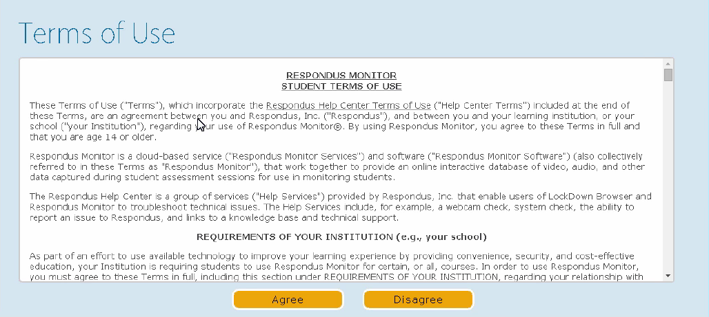

2. ***Webcam Check*** – El sistema verificará y confirmará que la cámara y el micrófono funcionan.
	- *Adobe Flash Player Settings* - Configuración de Adobe Flash. En el recuadro de Adobe marque los encasillados de `Allow` y `Remember`, luego oprima en botón `Close`.

	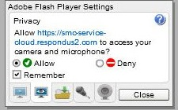

	- Si ve su imagen en la pantalla, oprima botón de `Yes`.

	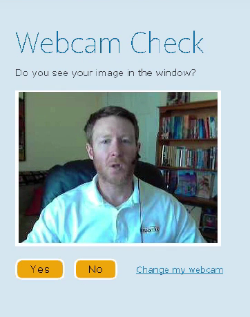

	- Ajuste la cámara hasta que su imagen se vea centralizada.

	- Mientras habla hacia la cámara, oprima el botón Record Five Second Video (grabe video de 5 segundos).

	

	- Mire el video para asegurarse que el audio y video se grabó. Luego, oprima el botón `Continue`.

	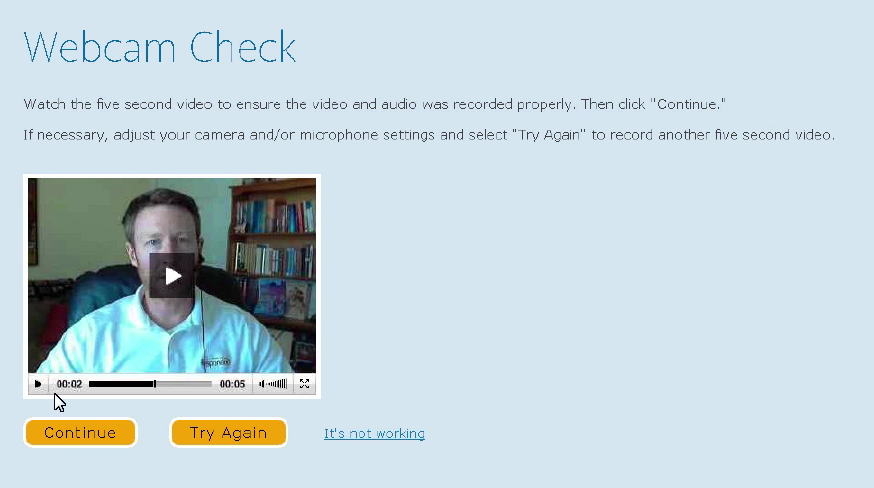

	- Si es necesario, ajuste cámara o micrófono y oprima en botón `Try Again` para grabar otro video.

3. ***Student Photo*** – Posicione su cara de manera que aparezca en la ventana de la foto. Oprima el botón `Take Picture`. Si está de acuerdo, oprima el botón `Continue`. Si quiere volver a tomarse otra foto, oprima el botón `Try Again`.

	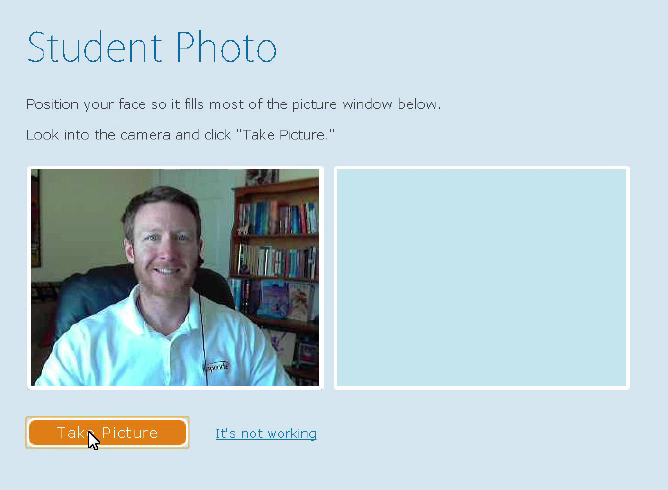

4. ***Show Identification*** – Muestre su Identificación hacia la cámara y seleccione el botón `Take Picture`. Asegúrese de que su cara aparezca cerca a la identificación.

	

5. ***Environment Check*** – El sistema tomará un video del área a su alrededor. Asegúrese de que no haya papeles, libros o teléfonos cerca.

	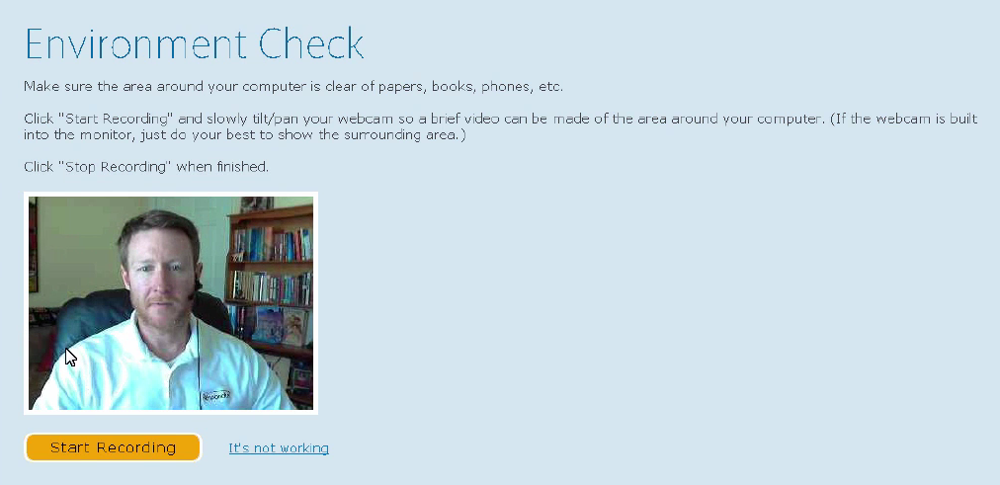

	- Oprima `Start Recording` y mueva lentamente la cámara de manera que se produzca un video del área a su alrededor. Si la cámara está integrada a la computadora, haga lo mejor posible para grabar. Cuando termine, oprima el botón `Stop Recording`.
	- Vea el video y asegúrese de que se grabó el área a su alrededor. Luego, oprima el botón `Continue`.

	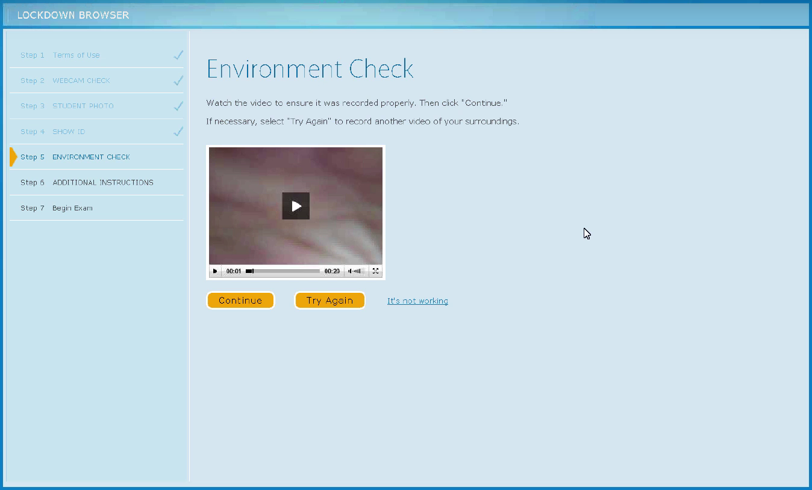

	> Si confronta dificultades con alguna de las acciones, seleccione el enlace `It’s not working`. El sistema le presentará varias opciones para tratar de resolver el problema técnico.

6. ***Additional Instructions*** – Lea las instrucciones y oprima en `Continue`.

	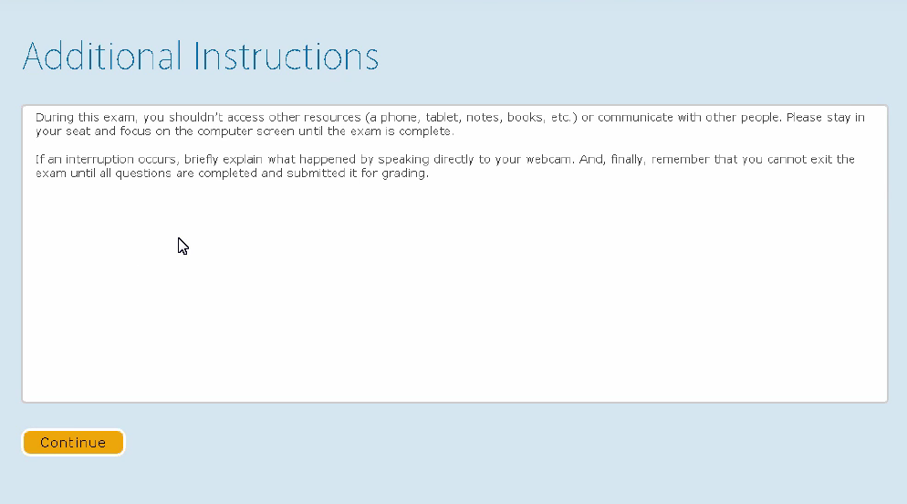

7. ***Begin Exam*** – Cuando termina el proceso de validación, el próximo paso lo lleva a comenzar el examen.

	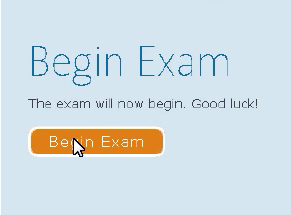

	> Al finalizar el examen, oprima en `Submit all and finish`.

## Dificultades durante el examen

Si presentó alguna dificultad técnica durante el examen, desde inconvenientes con la plataforma hasta fallas en la red, se recomienda que antes de someter el examen, se dirija a la cámara y explique la situación ocurrida.

También, puede enviar un mensaje al profesor del curso, en el área de mensajes, luego de que finalice y salga del navegador `LockDown Browser`, o enviar un correo electrónico.

En el contenido del correo electrónico debe incluir: su nombre completo, nombre y sección del curso. Además, indicar el examen que estaba realizando y el tipo de red al que estuvo conectado (`wifi` o `cable`), y una breve descripción del problema que presentó.

El profesor del curso evaluará el procedimiento seguido para verificar si es necesaria la reactivación del examen.