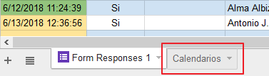
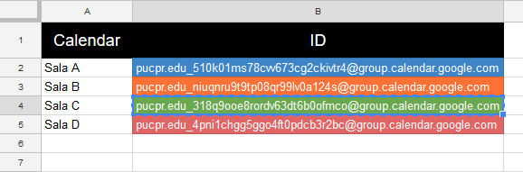
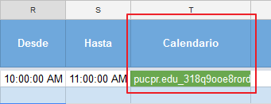
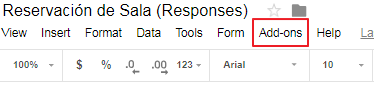
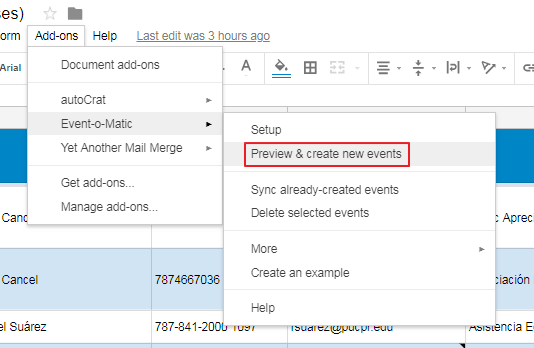
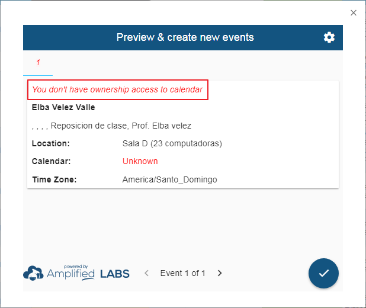

# Sincronización de reservaciones a los calendarios

Instrucciones paso a paso para sincronizar eventos a los respectivos calendarios del Instituto de Educación Virtual en el recinto del Ponce.

Una vez se haya verificado la información de la solicitud y la disponibilidad de la fecha para el evento, se comienza el proceso de sincronización.

Estos son los pasos a seguir:

1. Seleccione la hoja de cálculos llamada `Calendarios`, esta la puede encontrar en la parte inferior de la pantalla.

	

1. En esta hoja de cálculo, seleccione y copie el `ID` de la sala relacionada al evento.

	

1. Luego proceda a pegar la información en la columna `Calendario`.

	

1. Para comenzar el proceso de sincronización debe seleccionar `Add-ons` que se encuentra en la barra de herramientas en la parte superior de la hoja de cálculos.

	 

1. Una vez aparezca la lista de opciones, seleccione `Event-o-Matic` y luego `Preview & create new events`.

	

1. Se abrirá una ventana rectangular, en ella podrá revisar la información de los eventos que serán creados.

	

	> De encontrar errores en alguno de los eventos, deberá cerrar la ventana, hacer las correcciones necesarias en la hoja de cálculos y repetir los pasos 1 al 3.

1. Si la información de los eventos a sincronizar es correcta, prosiga a aceptar la transacción, oprimiendo el botón circular.

	

>### "You don't have ownership access to calendar"
>Si recibe este error `You don't have ownership access to calendar`, se debe a que el encacillado en la columna `Calendario` no contiene el `ID` del calendario de la sala relacionada al evento.

