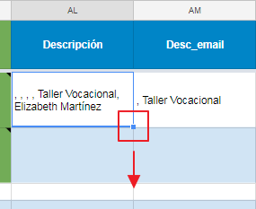
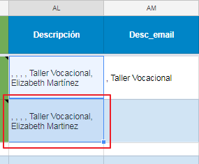
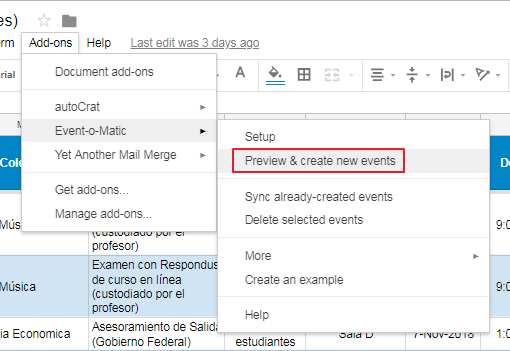
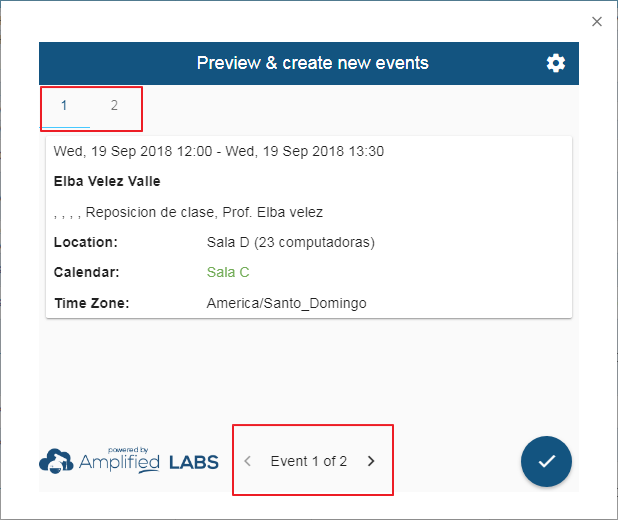

# Sincronización de reservaciones a los calendarios

Instrucciones paso a paso para sincronizar eventos en los respectivos calendarios del Instituto de Educación Virtual en el recinto del Ponce.

Una vez se haya verificado la información de la solicitud y la disponibilidad de la fecha para el evento, se comienza el proceso de sincronización.

Pasos a seguir:

1. Buscar la columna `Descripción` y `Desc_email`. Ahora exapanda la función de la celda anterior hacia abajo, agarrando la esquina derecha inferior.

	

1. Aparecerá información en la celda donde se expandió la función. Deberá repetir el paso anterior (paso 1) en la columna `Desc_email` para poblar la celda con información.

	

	> El propósito de la función es extraer información de otras columnas, para luego ser enviada como datos adicionales al calendario y al mensaje de confirmación.

1. Seleccione la hoja de cálculos llamada `Calendarios`, esta la puede encontrar en la parte inferior de la pantalla.

	

1. En la hoja de cálculo, seleccione y copie el `ID` de la sala relacionada al evento.

	

1. Luego proceda a pegar la información en la columna `Calendario`.

	

1. Para comenzar el proceso de sincronización, debe seleccionar `Add-ons` que se encuentra en la barra de herramientas en la parte superior de la hoja de cálculos.

	

1. Una vez aparezca la lista de opciones, seleccione `Event-o-Matic` y luego `Preview & create new events`.

	

1. Se abrirá una ventana rectangular, en ella podrá revisar la información de los eventos que serán creados.

	

	> De encontrar errores en alguno de los eventos, deberá cerrar la ventana, hacer las correcciones necesarias en la hoja de cálculos y repetir los pasos 4 al 6.

1. Si la información de los eventos a sincronizar es correcta, prosiga a aceptar la transacción, oprimiendo el botón redondo.

	

*****

### "You don't have ownership access to calendar"
Si recibe este error `You don't have ownership access to calendar`, esto se debe a que el encacillado en la columna `Calendario` no contiene el `ID` del calendario de la sala relacionada al evento.

