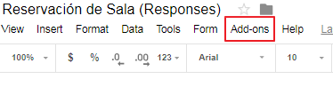
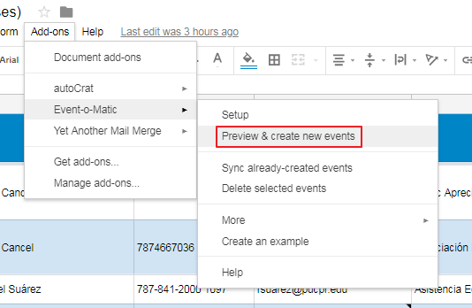
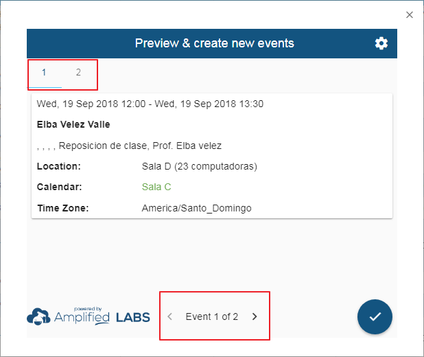

# Sincronización de reservaciones a los calendarios

Instrucciones paso a paso para sincronizar eventos a los respectivos calendarios del Instituto de Educación Virtual en el recinto de Ponce.

Una vez se halla verificado la información de la solicitud y la disponibilidad de la fecha para el evento, se comienza el proceso de sincronización.

Estos son los pasos a seguir:

1. Seleccionar `Add-ons` que se encuentra en la barra de herramientas en la parte superior de la hoja de cálculos.

   

2. Una vez aparezca el la lista de opciones, seleccione `Event-o-Matic` y luego `Preview & create new events`.

   

3. Se abrirá una ventana rectangular, en ella podrá revisar la información de los eventos que serán creados.

   

   > De encontrar errores en alguno de los eventos, deberá cerrar la ventana, hacer las correcciones necesarias en la hoja de cálculos y repetir los pasos 1 al 3.

4. Si la información de los eventos a sincronizar es correcta, prosiga a aceptar la transacción, oprimiendo el botón circular.

   

